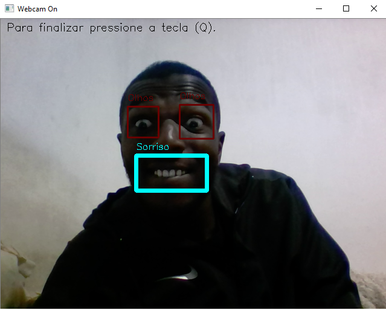

# Aprendizado de visão computacional real-time usando OPENCV e Python

*Me desculpem pela imagem não tão linda :):):)*

Aplicação de Visão computacional, sorriso e olhos real-time usando OPENCV e Python. A ideia é reconhecer rostos, um soriso ou os olhos usando a webcam do seu notebook.

# Motivação ;)

O intuito da apicação é entender como funciona o OPENCV e Visão computacional(Computer Vision)usando Python.

## Requisitos
    - [OpenCV 3.0](http://opencv.org/)
    - [Python > 3.5](https://www.python.org/downloads/)
    - [Haarcascades](https://github.com/opencv/opencv/tree/master/data/haarcascades)


# Executando o projeto
```
python detectFace.py
```

## Nota
- OpenCV 3.1 might crash on OSX after a while, so that's why I had to switch to version 3.0. See open issue and solution [here](https://github.com/opencv/opencv/issues/5874).
- Moving the `.read()` part of the video stream in a multiple child processes did not work. However, it was possible to move it to a separate thread.

## Falso Positivo
Ao realizar diversos testes pude perceber que ao usar o haarcascade(haarcascade_smile.xml) para detecção de sorriso
estava usando uma camisa da NIKE e o mesmo interpretou como sorriso, então . . . resumindo . . .
 
 *Não recomendo usar camisa da NIKE ao tentar detectar sorriso :)*


## Maquina usada para o desenvolvimento
* Processador: AMD 1.0 Ghz (Bem ruim, é eu sei, complicated)
* Memoria RAM : 6.0 
* OS WIndows 10 Pro 64 Bits

Make with love - @boscobecker